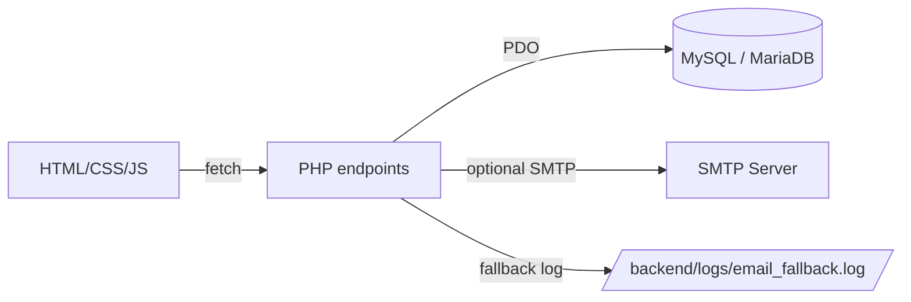
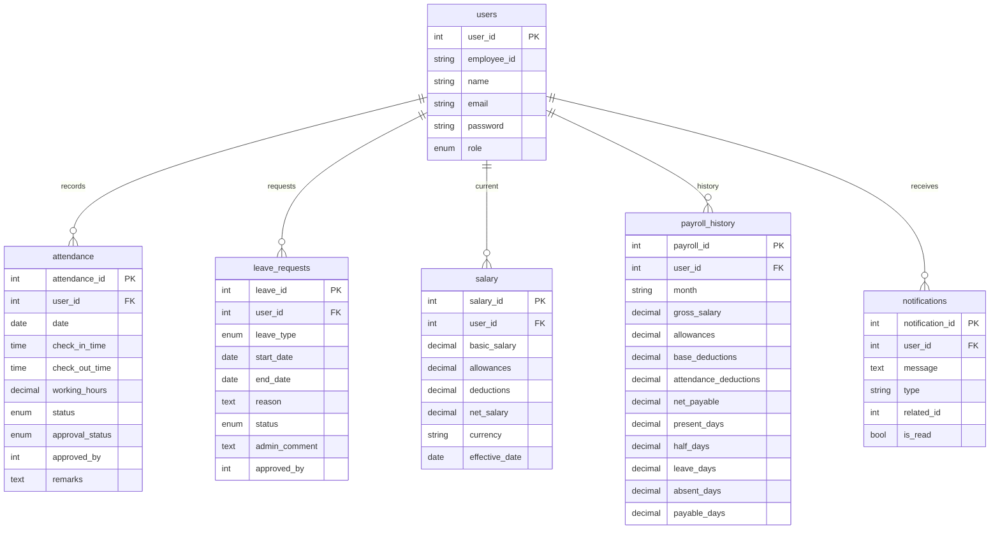
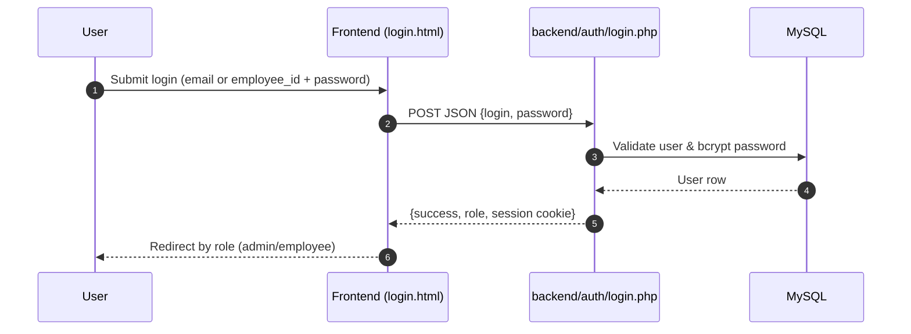
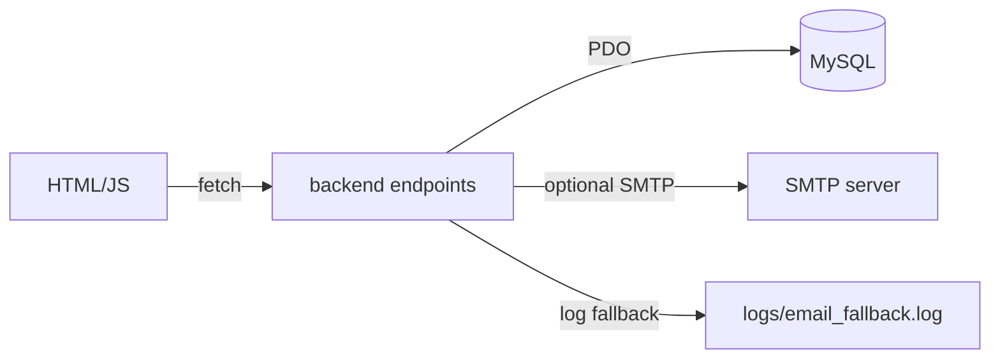
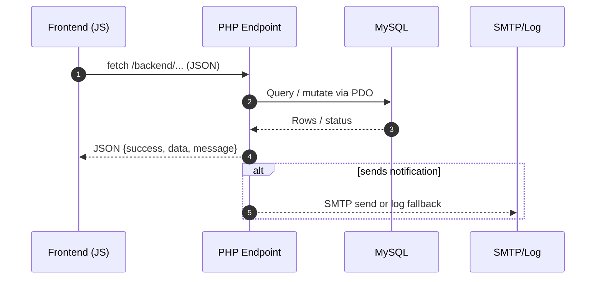

# 🌟 Dayflow HRMS

<p align="center">
    
</p>

> A clean, role-aware Human Resource Management System for attendance, leave, payroll, and profiles — built with PHP, MySQL, and vanilla HTML/CSS/JS on XAMPP.

[](https://www.php.net/)
[](https://www.mysql.com/)
[](#)
[](#)
[](#)

<details>
<summary><strong>Table of Contents</strong></summary>

- [Overview](#overview)
- [Feature Snapshot](#feature-snapshot)
- [Architecture at a Glance](#architecture-at-a-glance)
- [Visual Gallery (placeholders)](#visual-gallery-placeholders)
- [Directory Map](#directory-map)
- [Setup & Run](#setup--run)
- [Environment](#environment)
- [Database Schema](#database-schema)
- [Workflows](#workflows)
- [Request Lifecycle](#request-lifecycle)
- [Endpoints (high level)](#endpoints-high-level)
- [Frontend Pages](#frontend-pages)
- [Security & Ops Notes](#security--ops-notes)
- [Development Tips](#development-tips)
- [Roadmap Ideas](#roadmap-ideas)
</details>

## Overview
Dayflow HRMS delivers two tailored experiences: **admins** manage people, attendance approvals, and payroll; **employees** track attendance, request leave, and view salary details. Everything is lightweight, self-hostable, and friendly to local stacks (XAMPP/LAMP/WAMP).

## Feature Snapshot
- 🗂️ Clear separation of **frontend** (static HTML/CSS/JS) and **backend** (PHP APIs with PDO)
- 👤 Role-aware dashboards: admin vs employee
- 🔐 Bcrypt passwords, session-based auth, optional SMTP notifications with file-log fallback
- 🗃️ Core modules: attendance, leave, salary, payroll history, notifications
- 🧭 Simple fetch-based frontends that talk to PHP JSON endpoints

## Architecture at a Glance


## Visual Gallery (placeholders)
> Drop your own images into `frontend/assets/readme/` (create if missing). Use the filenames below so the README renders automatically:
> - `logo.png` (used in the header)
> - `login.png`
> - `admin-dashboard.png`
> - `employee-dashboard.png`
> - `attendance.png`
> - `leave.png`
> - `payroll.png`

| Screen | Description | Path |
| --- | --- | --- |
|  | Public login view | `frontend/assets/readme/login.png` |
|  | Admin KPIs & quick links | `frontend/assets/readme/admin-dashboard.png` |
|  | Employee snapshot: attendance, leave, payroll | `frontend/assets/readme/employee-dashboard.png` |
|  | Attendance tracking/approvals | `frontend/assets/readme/attendance.png` |
|  | Leave request & approvals | `frontend/assets/readme/leave.png` |
|  | Payroll history/generation | `frontend/assets/readme/payroll.png` |

## Directory Map
```
backend/
  admin/                  # Admin endpoints (employees, attendance approvals, payroll)
  auth/                   # Login / logout
  employee/               # Employee endpoints (attendance, leave, payroll, profile)
  config/                 # Database, email, session helpers
  upload-profile-picture.php
frontend/
  admin/                  # Admin dashboards
  auth/                   # Public login page
  employee/               # Employee dashboards
  assets/                 # Shared JS / CSS
hrms.sql                  # Full DB schema + seed admin user
fix_password.sql          # Helper to reset a specific user password
.env                      # SMTP settings (sample values)
```

## Setup & Run
1) Install **PHP 8+**, **MySQL/MariaDB**, and a web server (XAMPP/LAMP/WAMP).
2) Create database `hrms` and import `hrms.sql`.
3) (Optional) Reset a specific user password with `fix_password.sql`.
4) Update DB credentials in `backend/config/database.php` to match your local DB.
5) Configure SMTP in `.env` (or rely on fallback logs at `backend/logs/email_fallback.log`).
6) Place the project under your web root so routes resolve like `/hrms/frontend/...` and `/hrms/backend/...`.
7) Login via `frontend/auth/login.html` using the seed admin: `admin@hrms.com` / `password` (from `hrms.sql`).

## Environment
Defined in `.env` (already present):

| Key | Description |
| --- | --- |
| `SMTP_HOST`, `SMTP_PORT` | SMTP host/port |
| `SMTP_USERNAME`, `SMTP_PASSWORD` | SMTP credentials |
| `SMTP_ENCRYPTION` | `tls` / `ssl` / empty |
| `SMTP_FROM_EMAIL`, `SMTP_FROM_NAME` | From identity for outbound mail |

> Database credentials are currently in `backend/config/database.php`. You can align with `.env` for consistency if desired.

## Database Schema
**Tables**

| Table | Purpose |
| --- | --- |
| `users` | Employee/admin master data, auth (bcrypt passwords), role, profile info |
| `attendance` | Daily check-in/out, working hours, status, approval metadata |
| `leave_requests` | Leave applications with type, dates, status, approver comments |
| `salary` | Current salary components with generated `net_salary` column |
| `payroll_history` | Monthly payroll snapshots with attendance-derived deductions |
| `notifications` | User notifications (message, type, related_id, read flag) |

**ERD**


## Workflows

### Authentication & Session Flow


### Admin Core Flow (hire → track → pay)


### Data Access Flow


## Request Lifecycle


## Endpoints (high level)
- `backend/auth/login.php` – session login (email or employee_id + password)
- `backend/auth/logout.php` – destroy session
- `backend/admin/*` – add/update employees, attendance approvals, payroll generation
- `backend/employee/*` – attendance marking, leave requests, profile update, salary view
- `backend/upload-profile-picture.php` – profile photo uploads

## Frontend Pages
- `frontend/auth/login.html` – public login
- `frontend/admin/` – admin dashboard, employee CRUD, attendance, leave approvals, payroll, profile
- `frontend/employee/` – employee dashboard, apply leave, attendance view, salary, profile
- `frontend/assets/main.js` – login form validation + auth request

## Security & Ops Notes
- Bcrypt-hashed passwords; sessions for auth (harden cookies/HTTPS in production).
- If exposing publicly, cap upload size/type in `upload-profile-picture.php` and add CSRF tokens.
- Enable HTTPS + secure/session cookie flags in production.

## Development Tips
- Enable PHP error reporting in local dev as needed.
- Keep `.env` out of version control.
- Consider moving DB credentials into `.env` and loading them in `database.php` for parity with SMTP config.

## Roadmap Ideas
- CSRF tokens on mutating routes
- Pagination/filtering on admin listings
- Audit logs for approvals and payroll runs
- Small router to centralize auth checks and JSON responses

---
Feel free to rebrand the visuals and wording to match your organization. Happy shipping! 🚀
